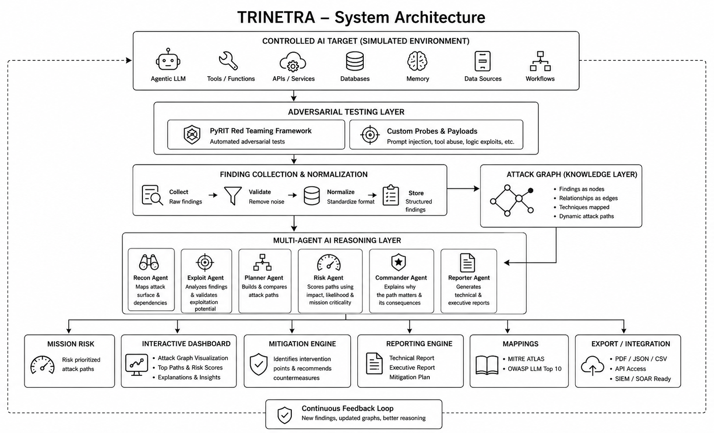

# TRINETRA

### Threat Reasoning Intelligence Network for Exploit Tracking & Response Architecture

**AI-Powered Multi-Agent Threat Reasoning Platform**

> **Seeing beyond vulnerabilities. Understanding attack chains.**

---

## Overview

TRINETRA is an AI-powered, multi-agent cybersecurity platform designed to discover, correlate, reason over, explain, and prioritize attack chains against **agentic AI systems** in a controlled and simulated environment.

Modern AI agents increasingly interact with tools, APIs, memory, databases, external data sources, and autonomous workflows. Traditional security approaches can identify individual vulnerabilities, but a single finding does not always reveal the larger risk created when several weaknesses interact.

TRINETRA addresses this gap by connecting security findings into **dynamic attack paths** and using specialized AI agents to reason over those paths.

> **Move from isolated vulnerability detection to explainable attack-chain intelligence.**

---

## The Core Idea

Traditional security assessment asks:

> **"What is vulnerable?"**

TRINETRA asks:

> **"How can it become mission compromise?"**

The platform transforms isolated security findings into explainable attack chains and prioritizes them using contextual factors such as impact, likelihood, and mission criticality.

---

## Methodology

TRINETRA follows an eight-stage reasoning pipeline:

```text
RECON
  ↓
ATTACK GENERATION
  ↓
FINDINGS
  ↓
ATTACK GRAPH
  ↓
MULTI-AGENT AI REASONING
  ↓
MISSION RISK
  ↓
MITIGATION
  ↓
REPORT
```

### 01 — Reconnaissance
Map tools, APIs, memory, data sources, and relevant interfaces of the controlled target.

### 02 — Attack Generation
Generate authorized adversarial tests using PyRIT and custom testing logic.

### 03 — Findings
Collect and normalize relevant security findings with technique, target, evidence, and context.

### 04 — Attack Graph
Connect findings and relationships into candidate attack paths.

### 05 — Multi-Agent AI Reasoning
Specialized agents evaluate, validate, compare, and explain candidate attack chains.

### 06 — Mission Risk
Prioritize paths using a proposed contextual model:

**Impact × Likelihood × Mission Criticality**

### 07 — Mitigation
Identify intervention points capable of disrupting high-priority chains.

### 08 — Reporting
Generate technical and executive outputs with relevant MITRE ATLAS and OWASP LLM Top 10 mappings.

---

## Multi-Agent Architecture

TRINETRA uses specialized agents with distinct responsibilities:

- **Recon Agent** — maps the target attack surface
- **Exploit Agent** — analyzes observed findings
- **Planner Agent** — constructs and compares attack paths
- **Risk Agent** — evaluates contextual risk
- **Commander Agent** — explains why a selected path matters
- **Reporter Agent** — generates structured security outputs

Agents are coordinated through a workflow-oriented orchestration layer.

---

## System Architecture



High-level flow:

```text
Controlled AI Target
        ↓
PyRIT / Adversarial Testing
        ↓
Finding Collection
        ↓
Neo4j Attack Graph
        ↓
Multi-Agent AI Reasoning
        ↓
Mission Risk
        ↓
Mitigation
        ↓
TRINETRA Dashboard + Reports
```

---

## Technology Stack

### AI / Agent Orchestration
- Python
- LangGraph
- LangChain
- Ollama

### Cybersecurity
- PyRIT
- MITRE ATLAS
- OWASP LLM Top 10

### Graph & Analysis
- Neo4j
- NetworkX

### Backend
- FastAPI
- Python

### Frontend / Visualization
- React
- Plotly / Streamlit

### Data / Deployment
- SQLite
- Docker
- GitHub

---

## Key Innovation

TRINETRA goes beyond isolated vulnerability detection by combining:

- Dynamic attack-chain discovery
- Multi-agent AI reasoning
- Graph-based security analysis
- Mission-aware risk prioritization
- Explainable attack-path analysis
- Actionable mitigation recommendations

### USP

> **We don't just detect the vulnerability.**  
> **We explain how it can become mission compromise.**

---

## Example Conceptual Attack Chain

```text
Prompt Injection
       ↓
Memory Poisoning
       ↓
Tool Abuse
       ↓
Privilege Escalation
       ↓
Mission Compromise
```

This is a simulated conceptual chain used to demonstrate correlation and reasoning. It is not intended as an operational exploitation guide.

---

## Mission Risk Model

TRINETRA proposes a contextual prioritization layer:

```text
IMPACT
   ×
LIKELIHOOD
   ×
MISSION CRITICALITY
   ↓
MISSION RISK SCORE
```

This is a prototype prioritization mechanism and is **not a replacement for CVSS or other established scoring standards**.

---

## Expected Outputs

### Software
- AI Attack Scanner
- Multi-Agent Reasoning Engine
- Attack-Chain Analysis Pipeline
- Dynamic Attack Graph
- Interactive Security Dashboard
- Mission Risk Prioritization Layer

### Security Intelligence
- Ranked attack paths
- Attack-chain explanations
- Finding relationships
- Mission Risk assessments
- MITRE ATLAS mappings
- OWASP LLM Top 10 mappings

### Reports
- Technical Security Report
- Executive Security Report
- Prioritized Mitigation Plan

---

## 36-Hour Proof-of-Concept Scope

The objective is not to build a production-grade military cybersecurity platform within a hackathon.

The objective is to demonstrate an end-to-end reasoning loop:

```text
DISCOVER → CORRELATE → REASON → PRIORITIZE → EXPLAIN → MITIGATE
```

### Must Demonstrate
- Controlled AI target
- Adversarial testing
- Finding collection
- Attack graph
- Multi-agent reasoning
- Mission Risk
- Dashboard
- Explainable attack chain

### Strong Enhancements
- MITRE ATLAS mapping
- OWASP LLM Top 10 mapping
- Automated reporting
- Additional simulated attack scenarios

---

## Controlled Environment & Responsible Use

TRINETRA is designed for **authorized, controlled cybersecurity testing**.

Demonstrations should use:

- Simulated AI systems
- Sandboxed environments
- Synthetic or dummy data
- Authorized test interfaces

The project is not intended to target real government infrastructure, live production systems, real personal data, or unauthorized third-party systems.

---

## Project Status

🚧 **Proof of Concept / Hackathon Prototype**

TRINETRA is being developed as a proposed solution for **Terrier Cyber Quest 2026**.

The repository will evolve as implementation progresses. Only functionality that is actually implemented and demonstrated should be represented as completed.

---

## Repository Structure

```text
TRINETRA/
├── README.md
├── .gitignore
├── architecture/
│   └── system-architecture.png
├── docs/
│   ├── methodology.md
│   └── TRINETRA_Terrier_Cyber_Quest_2026.pdf
├── backend/
├── agents/
├── attack_graph/
├── probes/
├── frontend/
├── data/
│   └── synthetic/
└── tests/
```

---

## Vision

As AI systems gain more tools, memory, access, and autonomy, cybersecurity must evolve from checking isolated components toward understanding **relationships, sequences, and consequences**.

TRINETRA explores that direction through:

> **AI × Cybersecurity × Graph Reasoning × Mission Context**

---

## Disclaimer

TRINETRA is a cybersecurity research and hackathon proof-of-concept.

The project does not claim production readiness, guaranteed vulnerability discovery, guaranteed prevention of compromise, or autonomous zero-day discovery.

Any risk score, attack path, or dashboard metric shown in demonstrations should be treated as an illustrative prototype output unless explicitly identified as a measured result.

---

## Team

### TRINETRA — Terrier Cyber Quest 2026

**AI × Cybersecurity × Defence Technology**

---

> **TRINETRA turns isolated AI security findings into explainable, mission-aware attack-chain intelligence.**
